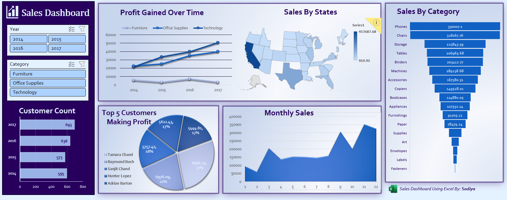

# Sales-Dashboard-Using-Excel-

## 🚀 Overview  
Welcome to the Sales Dashboard project repository!
This project focuses on analyzing sales data of a US-based company (2014–2017) and transforming raw data into meaningful insights using Microsoft Excel.
An interactive dashboard has been created to help explore key business metrics such as revenue trends, profitability, customer performance, and regional sales distribution.

---

## 🎯 Objective  
To convert raw sales data into actionable insights that support data-driven decision-making by visualizing trends, identifying patterns, and highlighting business performance indicators.

---

## 🧰 Tools & Technologies  
- Microsoft Excel  
- Pivot Tables  
- Pivot Charts  
- Slicers & Filters  
- Conditional Formatting
- Data Cleaning and Formatting 

---

## ✨ Features  
- 📈 Sales trend analysis over time  
- 🗺️ State-wise sales performance  
- 👥 Top customers identification  
- 📅 Monthly sales analysis  
- 💰 Profitability analysis by category  
- 🎛️ Interactive dashboard with slicers  

---

## 📊 Dashboard Preview  

---

## 📁 Repository Structure  
- 📂 Data → Raw dataset  
- 📂 Dashboard → Excel dashboard file  
- 📂 Images → Dashboard screenshots  
- 📄 Sales_Dashboard.xlsx  

---

## ▶️ How to Use  
1. Clone this repository  
2. Open the `Sales_Dashboard.xlsx` file in Microsoft Excel  
3. Navigate through different sheets  
4. Use slicers and filters to interact with the dashboard  

---

## 📌 Key Insights  
- Identified top-performing products contributing major revenue  
- Analyzed seasonal sales trends  
- Discovered high-value customers and regions  
- Evaluated profit distribution across categories  

---

## 💡 Skills Demonstrated  
- Data Cleaning & Preparation  
- Data Analysis  
- Data Visualization  
- Dashboard Design  
- Business Intelligence  

---

## 🔗 Connect With Me  
- 💼 LinkedIn: www.linkedin.com/in/sadiya-ansari-a44274319
- 💻 GitHub:  https://github.com/Sadiya6767

---

## 🏷️ Tags  
#DataAnalysis #Excel #Dashboard #BusinessIntelligence #DataVisualization #SalesAnalytics  

---

⭐ *Turning raw data into meaningful business insights.*

